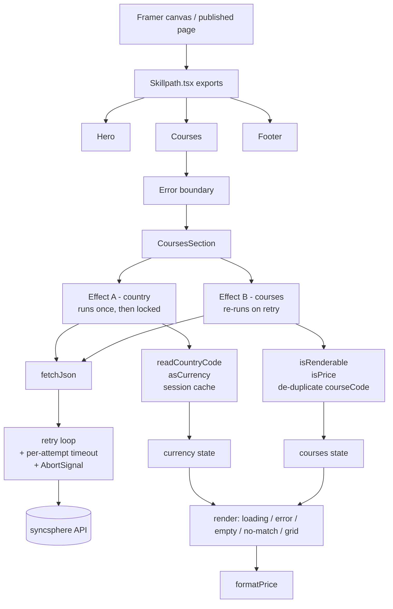

# Skillpath

A landing page for a fictional learning platform, built as Framer code components.
The part that matters is the courses section: it pulls live data from an API that
is deliberately unreliable, and it has to stay useful when that API misbehaves.

**Stack:** Framer (code components), React, TypeScript, plain CSS (inline styles
plus one injected stylesheet), and the Fetch API. No other libraries.

Everything lives in one file, `Skillpath.tsx` (~1,350 lines), which exports three
components — `Hero`, `Courses`, `Footer`.

**Live site:** https://skillpathwebveda.framer.website/

- [`note.md`](note.md) — the 200-word submission note
- [`CHAT-TRANSCRIPT.md`](CHAT-TRANSCRIPT.md) — the full working session

---

## 1. What the assignment asked for

**Page structure:** a hero (headline, one line under it, one button), a courses
section driven by live API data, and a footer (three links, copyright line).

**Courses section:**

- Live data from `https://syncsphere-hiv6.onrender.com`
- `/assignment/course-data` — 5 to 10 courses, count varies between calls
- `/assignment/country-code` — returns `IN` or `US`, decides which currency to show
- Each card: course name, description clamped to two lines, price in the right
  currency, and one more field of my choosing
- Four states: loading, error, empty, working
- 3 columns desktop / 2 tablet / 1 mobile, nothing breaking in between
- Exactly two property controls
- GET only — every other method returns 405
- No hardcoded data

**Optional extras.** All five were implemented: skeleton loaders, a search box,
price sorting, a refundable badge that only shows when true, and a retry button.
They went in last, after the core states were solid and tested — the brief is
explicit that skipping them costs nothing, so none of them were allowed to
complicate the fetch path. Search and sort filter data that has already arrived
and been validated; neither adds a network call.

---

## 2. Before writing any UI, I probed the API

The brief describes the API, but a description isn't behaviour. I spent the first
stretch of the project hitting both endpoints ~150 times with curl before writing
a line of component code.

### Failure rates

| Endpoint | Success | 500 | 404 | Failure rate |
|---|---|---|---|---|
| `/assignment/course-data` | 29/40 | 8 | 3 | **27.5%** |
| `/assignment/country-code` | 21/40 | 11 | 8 | **47.5%** |

The brief says "roughly 1 in 3, both endpoints". Course data matches that. Country
code measured closer to 1 in 2. That gap is the single most important thing I
found, because it means both calls succeeding on a first attempt happens only
about 38% of the time — so whatever I did when country detection failed was going
to be the **common** path, not an edge case.

(40 samples per endpoint. Indicative, not a precise measurement.)

### Error bodies

Failures return FastAPI-style JSON with joke strings:

```json
{"detail":"gg"}
{"detail":"FAAAAAAAAAAA"}
{"detail":"this aint working dawg"}
```

These are not user-facing copy. The lazy pattern — `catch(e => setError(e.detail))` —
would print **"FAAAAAAAAAAA"** on a landing page. Nothing from a response body ever
reaches the DOM in the final code.

### Failures are random and independent

No stickiness, no rate limiting, no `Retry-After`. Latency is a flat ~260ms on
success *and* on failure. That mattered twice:

- Retries work extremely well, because a retry is a fresh independent roll.
- Long exponential backoff would be pointless. Backoff exists to relieve a
  struggling server; this one fails instantly by design. `1s / 2s / 4s` would make
  the page feel broken for no benefit.

### The 404s are synthetic

`/docs` and `/openapi.json` are live. The spec registers every non-GET verb
explicitly as a `*_wrong_method` handler, and shows the 404 and the 500 coming
from the same injected failure. So in this component I retry 404s as well as 500s.
Against a real API I would retry 5xx only — a real 404 won't fix itself.

### CORS and methods

`access-control-allow-origin: *` on GET. Because the request is a bare GET with no
custom headers, no preflight fires at all. Two rules fell out of that: don't add
`Accept`/`Content-Type` headers (buys a pointless round trip), and never use
`credentials: "include"` — the server sends `allow-credentials: true` alongside `*`,
which browsers hard-reject.

`POST`, `PUT`, `PATCH`, `DELETE` and `HEAD` all return 405.

### Shape of the data

Exactly **10 fixed courses**. Every response is the first N of them (N between 5
and 10) in a stable order — a prefix, not a random sample. All ten keys present on
every object across every sample I collected. That's why `courseCode` is safe to
use as a React key.

Descriptions run 107–132 characters, so the two-line clamp genuinely truncates at
card width rather than being decorative.

### The prices are not conversions

This is the finding that shaped the biggest design decision in the project.

| Course | INR | USD | Implied rate |
|---|---|---|---|
| how-to-youtube | ₹1,999 | $39.99 | 50.0 |
| notion-second-brain | ₹799 | $14.99 | 53.3 |
| email-marketing-craft | ₹1,299 | $24.99 | 52.0 |

Implied rate across all ten courses: **50.0 – 53.3**. The real rate is around 87.
These are independent regional prices, not FX conversions of one another. Showing
the wrong region's price understates the US price by about **1.7x** — a US visitor
shown ₹1,999 would mentally convert it to roughly $23 when they'd actually pay
$39.99.

### One testing gotcha

My first ordering test used Python's `urllib` and got 0/12 successes, which looked
alarming. It was Cloudflare rejecting the default `python-urllib` user agent, not
the API failing. Re-running with curl gave the expected ~72%. Worth knowing if
anyone else scripts against this endpoint.

### What I could not confirm

Render's free tier sleeps after ~15 minutes idle, and the first request after that
can reportedly take 30s+. I never observed a cold start — the service stayed warm
across roughly 150 requests. So the cold-start handling in the final code is
reasoned from documented behaviour, not measured. I've flagged this as a known gap
rather than pretending otherwise.

---

## 3. What the probe changed

Concretely, the investigation set these decisions before any UI existed:

- **Retry everything, with short delays.** Independent instant failures make
  retries cheap and effective.
- **Treat the two endpoints as separate operations.** Their failure rates differ,
  and so do the consequences of failing.
- **Never render a response body.** The joke strings guaranteed that.
- **Don't guess a currency.** The 50-vs-87 rate finding made a wrong guess a
  materially wrong price, not a cosmetic mismatch.
- **Validate prices.** If the API can be hostile on purpose, it can be malformed.

The principle I kept coming back to: the section should stay useful when part of
the API fails, and it should never state something false in order to look complete.

---

## 4. Architecture



The shape worth noticing: **two effects, two independent state slices**. They are
never joined. That is deliberate and is explained in §6.

---

## 5. Implementation, step by step

### 5.1 Component setup

A React code component, not Framer's Fetch feature — Fetch can't iterate an array,
so it cannot build a grid from a variable-length list.

Three named exports in one file. Framer lists each exported component separately in
the Assets panel. They share the palette tokens (`FONT`, `INK`, `MUTED`, `SUBTLE`,
`FAINT`, `LINE`, `SURFACE`, `CANVAS`), the accent stylesheet, and `DEFAULT_ACCENT` —
which is the reason they were merged into one file partway through the project
rather than kept as three.

Each component carries its own `@framerIntrinsicWidth` / `@framerIntrinsicHeight`
annotations in the comment directly above it.

### 5.2 The fetch layer

`fetchJson<T>(path, attempts, signal)` is the only function that touches the
network, and it is used by both endpoints. Conceptually:

- Loop up to `attempts` times.
- On attempts after the first, wait `250 * i` ms — 0, 250, 500. Short on purpose,
  for the reason in §2.
- Issue a bare `fetch` (no method, no headers → GET, no preflight).
- If `!res.ok`, throw. The body is never read on the failure path.
- If the outer signal has aborted, rethrow immediately and stop looping.
- Parse and return on success.

Two details that matter:

**The attempt counter is a loop variable, never React state.** Putting retry counts
in `useState` is what turns these components into 200-line state machines — every
attempt re-renders, and then you start guarding effects against your own retries.

**The `signal.aborted` check is what stops a superseded run.** Without it, an
unmount mid-flight would abort attempt 1 and then dutifully sleep and fire attempts
2 and 3 into a component that no longer exists.

### 5.3 Two endpoints, two effects

An earlier version of my plan fetched both endpoints in one effect. The final code
uses **two separate effects**, and I did not need `Promise.all` or
`Promise.allSettled` at all — because the results are never joined:

- **Effect A — country.** Runs once. Guarded by `if (staticRender || settled.current) return`.
- **Effect B — courses.** Re-runs when the retry nonce changes.

Consequences:

- Courses render the moment they arrive; they never wait on the slower, flakier
  country call. While country is still resolving, the price slot shows a small
  shimmer and the rest of the card is fully readable.
- The country call failing does not touch the grid.
- The courses call failing does not touch the currency.
- Country gets **4 attempts** to courses' **3**, because it fails at ~47% versus
  ~27%. This costs no wall-clock time since they run in parallel.

---

## 6. Currency: the biggest decision

### The question

The country endpoint fails about half the time. What do you show when it fails?

### My first answer, and why I threw it away

The first thing I sketched was: default to INR, disclose it with a small note.
That was wrong, and I only found out because I checked whether the two price
fields were equivalent before committing to it.

They aren't (§2). Implied rate ~50, real rate ~87. Defaulting means a US visitor
sees a price about 1.7x below what they'd actually be charged. That's not a
cosmetic mismatch — on a pricing page it's a false statement. "Default with a
disclaimer" is the same lie, just disclosed.

### What I compared

| Fallback | Shows a wrong price? | Courses visible? |
|---|---|---|
| Default to INR silently | Yes — 1.7x off for US | Yes |
| Default to INR + disclaimer | Yes, just disclosed | Yes |
| Hide the price entirely | No | Yes, but gutted |
| **Show both** | **No** | **Yes, intact** |

Hiding the price also avoids lying, but it throws away the field the section exists
to show — and an empty price on a pricing page reads as broken.

### The final ladder

1. Try to detect the region.
2. On failure, retry — 4 attempts, which takes ~47% down to roughly 10%.
3. If we ever detected a region successfully this session, reuse it from
   `sessionStorage`. A visitor's region doesn't change mid-session.
4. If it's still unknown, **show both real prices**: `₹1,999.00 · $39.99`, with one
   quiet line under the heading — *"Showing both currencies — we couldn't detect
   your region."*

Both numbers are true. Nobody is shown a false price, the grid stays intact, and
the section never blocks on the flakier call.

Anything that isn't exactly `IN` or `US` counts as unknown — not as a default. If
the API returned `GB`, a null, a number, or a nested object, that falls into
dual-price. Lowercase `"in"` is rejected too. If the API ever switched casing, every
visitor would drop to dual-price rather than silently getting a possibly-wrong
region, which is the safer direction to fail in.

### What I can and can't promise

- **Within a session:** guaranteed stable. The currency is write-once.
- **Across a reload:** not guaranteed. A fresh successful call wins over the cache.
  I kept it that way deliberately — against a real geo-IP endpoint a fresh detection
  *should* beat a stale one.

The honest framing: this endpoint is random, not geographic, so no client can make
it *correct*. What I can do is make it **consistent** within a session, with an
explicit unknown state when detection fails.

---

## 7. The currency-lock bug

This is the bug I'm most glad I caught, and I caught it by asking a question about
my own design rather than by seeing it fail.

### The setup

The country endpoint returns `IN` or `US` **at random on every call**. It isn't
geographic at all.

### The question

Since it flips, should we retry it at all? Could retrying change the currency?

### The first half of the answer

No — retrying is safe. `fetchJson` returns on the first `res.ok` and only loops on
failure. A failed call carries no country code, so a retry isn't replacing a value,
it's fetching one we never got. `500 → (no value) → 200 "US" → set once, loop exits`.

### The second half — the actual bug

But my structure at that point had **one effect fetching both endpoints**, keyed on
the retry nonce. So: country succeeds with `IN`, courses fail, the user clicks
**Try again** — and country gets called *again*, and can come back `US`. Prices flip
under someone who was only trying to reload the grid.

### The fix

Split the effects by lifetime, and lock the detected value in a ref:

```ts
const settled = useRef<Currency | null>(null)

useEffect(() => {
  if (staticRender || settled.current) return   // never re-detect a known region
  ...
}, [nonce, staticRender])
```

One guard line, and it states the policy out loud: once we know the region, we stop
asking. The retry button now means "try the courses again", which is what a user
pressing it actually intends.

I deliberately kept `nonce` in the deps rather than using `[]`. If country failed
all four attempts we're on dual-price with `settled.current === null`, so Retry gets
a fresh shot at detection. There's no established value to contradict, so exactly
the safe retries are permitted.

### The regression test

I built a mock that returns `IN` on the first call and `US` on **every** call after,
with courses failing all three attempts so the error state appears. Then I clicked
Try again:

```
countryCalls: 1   (unchanged)
courseCalls:  3 → 4
prices:       ₹1,999 … all rupees
anyDollar:    false
```

Without the lock that grid would have come back in dollars. I also hammered the
retry button — five clicks 80ms apart, then five clicks in a single tick — and got
**one** new request both times, because the first click switches to the loading
state which unmounts the button, and React batches same-tick state updates. The
invalid state is unreachable by construction, so there's no debounce or disabled
flag anywhere.

---

## 8. Price formatting

The API returns hundredths. `pricePaise: 199900` is ₹1,999.00, not ₹1,99,900 — and
the brief calls that trap out explicitly.

It's a nastier trap than it looks, because `en-IN` uses lakh grouping. Forgetting
the `/100` produces exactly the string the brief says ends the review:

```
wrong:  ₹1,99,900     (Intl.NumberFormat("en-IN").format(199900))
right:  ₹1,999.00     (…format(199900 / 100))
```

The division happens in `formatPrice` and nowhere else — two lines in the whole
file. Both formatters are module-level constants, built once rather than per render.

### The decimal bug I introduced and then fixed

My first configuration was INR `minimumFractionDigits: 0, maximumFractionDigits: 2`
and USD `2, 2`. That's asymmetric, and worse, it's wrong for money: a value of
`199950` paise renders as **`₹1,999.5`** — a single decimal place, which no currency
uses. Every live price happens to be a whole rupee, so it never showed. The
formatter was only accidentally correct.

Both are now pinned to `2, 2`. The visible cost is that whole rupees render as
`₹1,999.00` rather than `₹1,999`, which is less conventional for an Indian pricing
page. The alternative is `trailingZeroDisplay: "stripIfInteger"`, which I noted but
did not ship.

### Verified output

16 exact-string assertions against the rendered DOM, including:

| paise | rendered | cents | rendered |
|---|---|---|---|
| 199900 | `₹1,999.00` | 3999 | `$39.99` |
| 199950 | `₹1,999.50` | 3950 | `$39.50` |
| 1 | `₹0.01` | 1 | `$0.01` |
| 0 | `₹0.00` | 0 | `$0.00` |
| 99999900 | `₹9,99,999.00` | 1199999 | `$11,999.99` |
| 12345678 | `₹1,23,456.78` | 234567 | `$2,345.67` |

`₹1,99,900` confirmed absent from the DOM.

At character level the rupee sign is real U+20B9 and neither formatter inserts a
non-breaking space between symbol and digits. INR grouping goes 3-then-2-then-2
(`₹1,00,00,999.00` at crore scale) because of the `en-IN` locale — using `en-US`
with `currency: "INR"` would render `₹1,000,999.00`, which is wrong for this page.
The locale choice is load-bearing, not decorative.

---

## 9. Validation

I didn't validate incoming courses at first beyond checking `courseName` was a
string. That got questioned, and testing showed it wasn't nearly enough.

### The `null → ₹0` bug

```
null      → null/100 = 0    → "₹0"
undefined → NaN            → "₹NaN"
-5000     → -50            → "-₹50"
```

**`₹0` is the dangerous one.** `₹NaN` is obviously broken — anyone would spot it.
`₹0` reads as "this course is free": a wrong price rendered plausibly, which is
squarely in the brief's instant-fail column. `-₹50` has the same problem.

### The guards

```ts
const isPrice = (n: unknown): n is number =>
    typeof n === "number" && Number.isFinite(n) && n >= 0

const isRenderable = (c: unknown): c is Course => { … }
```

`isRenderable` requires a non-empty `courseCode`, a non-empty `courseName`, and
**both** price fields valid. Both, not just the displayed one — the currency is
decided at render time, and the dual-currency fallback needs both. Validating only
`pricePaise` would still produce `$NaN` for a US visitor.

Zero is allowed through: a genuinely free course is valid data, not a broken field.

Numeric strings like `"199900"` are rejected on purpose, even though they'd format
correctly. Same rule as the currency: when the data isn't what we expect, don't
guess at it. The trade-off is real — if the API switched to string prices, every
course would be dropped — and I chose consistency with the rest of the component.

`isRenderable` takes `unknown`, not `any`, and reads fields through
`Partial<Record<keyof Course, unknown>>`. That keeps the field names type-checked:
I proved this by introducing a `v.courseNam` typo, which became a compile error.
Under `any` it would have compiled silently and dropped every course at runtime —
in the one function whose entire job is catching bad data.

For the same reason `fetchJson<unknown>` is used rather than `fetchJson<Course[]>`.
The helper casts whatever JSON arrives; claiming `Course[]` there would be a promise
the API never made. `Course[]` comes out of `raw.filter(isRenderable)`, which is the
only thing that has earned the type.

### Uniqueness

Type-checking `courseCode` doesn't make it unique, and duplicate React keys are
worse than missing ones — React reuses the wrong card on re-render rather than just
warning. So the list is de-duplicated, first occurrence winning. Tested with three
courses sharing one code: 4 in, 2 rendered, no React key warning, because they're
removed before render rather than after React complains.

### Graduated failure

Hard-fail on identity and price; soft-degrade on cosmetics. Losing a whole course
over a missing description would be the worse trade.

Hostile payload test — 12 items in, **3 rendered**:

| Input | Outcome |
|---|---|
| `pricePaise: null` | dropped (would have shown `₹0`) |
| missing `priceUsdCents` | dropped |
| `pricePaise: "199900"` | dropped |
| `pricePaise: -5000` | dropped |
| `pricePaise: NaN` | dropped |
| missing `courseCode` | dropped |
| `courseName: ""` | dropped |
| `null` / `"not an object"` | dropped |
| no description or category | **kept**, renders clean |
| `pricePaise: 0` | **kept** — free is valid |

A separate 8-item test confirmed the soft path: missing description, missing
category, missing `refundable`, and a course with *no* optional fields at all all
render correctly — title and price, no empty chip row, no leftover spacing. No
`undefined`, `null` or `NaN` anywhere in the DOM.

Dropped items log a dev-facing `console.warn`. Nothing reaches the page.

---

## 10. Empty versus broken

The empty state means one specific thing: **the API told us there are zero courses.**

I originally treated any unusable response as empty. That got questioned and it was
right to question — a 200 carrying something that isn't a list never said the
catalogue was empty, so "No courses available right now" would report an empty
catalogue when the truth is a broken response.

Final behaviour:

| Response | State |
|---|---|
| `{courses: []}` (an object) | ERROR |
| `null` | ERROR |
| `"no courses today"` | ERROR |
| **`[]`** | **EMPTY** |
| array where nothing survives validation | ERROR |
| valid array | GRID |

The second-to-last row extends the same reasoning one level down: if eight courses
arrive and not one survives validation, that's bad data wearing a 200, not an empty
catalogue.

Routing both to the error state is also more *useful*, not just more honest — the
error state carries a retry button, and against an API this flaky a retry may well
fix it. The empty state offers nothing to do, and correctly shows no retry button
and no search box.

---

## 11. Timeouts

Retries handle a request that *fails*. They do nothing for a request that *hangs* —
and that was raised as a gap after the retry logic was already working.

```ts
const TIMEOUT_COLD = 15000   // attempt 1
const TIMEOUT_WARM = 6000    // later attempts
const SLOW_HINT_MS = 6000

signal: AbortSignal.any([
    signal,
    AbortSignal.timeout(i === 0 ? TIMEOUT_COLD : TIMEOUT_WARM),
])
```

**Why the first attempt is treated differently.** A hang and a Render cold start
look identical for the first few seconds. The free tier sleeps after ~15 minutes and
can take 30s+ to wake, so a short uniform timeout would abort a request that was
going to succeed. By attempt two the instance is either awake — answering in ~260ms —
or genuinely broken, so 6s is plenty.

The two signals are combined so that a timeout aborts only the *inner* one. The
outer `signal.aborted` stays false, so the catch treats it as an ordinary failure
and retries. Getting that backwards would mean the first timeout silently killed
all remaining attempts.

Measured against a mock that never answers:

```
 0.1s  attempt 1 started
 6.4s  "Still loading — the server may be waking up."
15.5s  attempt 1 aborted (TimeoutError)
16.4s  attempt 2 started
23.4s  attempt 2 aborted
24.4s  attempt 3 started
30.4s  attempt 3 aborted  →  ERROR + retry
```

A useful side effect: even when we give up, the attempts have *woken the server*,
which is why the retry button tends to work immediately after a cold-start failure.

---

## 12. Loading and error states

**Skeletons, not a spinner.** They show the real card layout at real proportions, so
the page doesn't jump when data lands. Six of them — a placeholder shape, not a
promise of how many are coming, since the count varies 5–10.

**The slow hint.** A timeout alone still leaves someone watching silent skeletons
for 15 seconds. At 6s a line appears above them: *"Still loading — the server may be
waking up."* It's honest about what's happening rather than a generic spinner.

**Error state:**

```
We couldn't load the courses.
The connection dropped on the way. It's usually temporary.
[ Try again ]
```

No status codes, no `detail` strings, no stack traces. Retry re-fetches courses
only, never the region.

---

## 13. The course cards

| Field | Source | If missing |
|---|---|---|
| Course name | `courseName` | course is dropped |
| Description | `description` | omitted, card still renders |
| Price | `pricePaise` / `priceUsdCents` | course is dropped |
| Category chip | `mainCategory` | chip omitted |
| Refundable badge | `refundable` | badge omitted |

**Why `mainCategory` is the "one more field".** It's present on every course, and it
helps a learner scan a grid. I picked it over `refundable` for the required field
specifically because `refundable` is false on 3 of the 10 courses — choosing it alone
would leave 30% of cards with no extra field at all. `refundable` is then the
conditional bonus badge from the optional list, shown only when `true`.

The description is clamped to two lines with `-webkit-line-clamp`. Verified with a
2,400-character description: clamps to exactly two lines with an ellipsis, and cards
in the same row stay the same height because `marginTop: auto` on the price row pins
the price to the bottom regardless of how much text sits above it.

---

## 14. Responsive grid

### First version, and the bug

```css
grid-template-columns: repeat(auto-fill, minmax(300px, 1fr));
```

I checked this and reported it as fine. **It wasn't, and my check was flawed** — I
compared *column counts* only. When it later got questioned directly, measuring the
track against the available width showed real overflow:

| viewport | available | track | overflow |
|---|---|---|---|
| 348px | 300 | 300 | ok |
| 340px | 292 | 300 | **+8px** |
| 320px | 272 | 300 | **+28px** |
| 280px | 232 | 300 | **+68px** |

Below 348px (a 300px track plus 48px of padding) the page scrolled sideways. It
never appeared at 375px and up, which is why the screenshots looked clean.

### The fix

```css
grid-template-columns: repeat(auto-fill, minmax(min(300px, 100%), 1fr));
```

A bare `300px` in `minmax()` is a **hard** minimum — the track refuses to shrink
below it even when the container is narrower, and just overflows. `min(300px, 100%)`
makes the floor conditional: 300px whenever the container is wider, collapsing to
the container width when it isn't. It only changes behaviour in the case that was
broken, which is why every column count stayed identical.

Section padding also became fluid: `clamp(56px, 8vw, 80px) clamp(16px, 4vw, 24px)`.

### Verified

29 widths from 2560px down to 240px, run against worst-case content:

```
2560 1920 1680 1440 1366 1280 1180 1024  →  3 columns
 912  853  820  768  744  712            →  2 columns
 653  600  540  480  430  414  393  375
 360  344  320  300  280  260  240       →  1 column
```

Zero overflow at every width. No `@media` query anywhere — the 3/2/1 behaviour falls
out of `auto-fill` plus a 1200px container cap, so there are no gaps between
breakpoints to get wrong.

Card counts 5, 6, 7, 8, 9 and 10 all render exactly what arrived, with partial last
rows (including a single orphan card) sitting at normal track width. That's why
`auto-fill` rather than `auto-fit` — `auto-fit` collapses empty tracks, so one
leftover card would balloon to full width.

### Long content

Long names *with spaces* always wrapped. An unbreakable token did not:

| content | overflowed card by |
|---|---|
| 103-character single word | **640px** |
| URL-style name | **351px** |
| whole page | **491px** |

Two changes fixed it. `minWidth: 0` on the card, because a grid item's default
`min-width: auto` means its min-content size — one unbreakable word — forces the
track wider than the container. And `overflowWrap: "anywhere"` rather than
`break-word`: both wrap visually, but only `anywhere` reduces the min-content
contribution that grid track sizing actually measures. `break-word` alone would have
looked fixed and still blown out the grid.

Applied to the name, description, category chip, and the no-match heading — that
last one interpolates whatever a visitor types into the search box.

### A testing limitation, stated honestly

`clamp()` uses `vw`, which resolves against the real browser viewport, not the
container I was resizing in my harness. So the *layout* results above are
trustworthy, but the *type scale* at mobile isn't — the harness always rendered the
desktop end of each clamp. On a real 390px phone the hero headline drops to its 34px
floor rather than the 60px I saw.

---

## 15. Search and sort

Both filter data that has already arrived and been validated. Neither adds a network
call — a request per keystroke against a 1-in-3 failure rate would flicker the whole
section into the error state while somebody is mid-word.

**Search** matches course name and category, trimmed and case-insensitive. It only
appears once there is something to search; in the error and empty states it's absent,
because a search box above a failed load is furniture, not help.

**No matches gets its own state**, separate from the API-empty state, with different
copy and a **Clear search** button:

```
No courses match "quantum physics".
Try a different word, or browse everything.
[ Clear search ]
```

"No courses available right now" would be a lie here — the catalogue is full, the
filter is just narrow. And unlike an empty catalogue, this is something the visitor
can fix.

One bug avoided by the earlier validation work: `mainCategory` is deliberately *not*
validated, so `c.mainCategory.toLowerCase()` would throw on the first keystroke for a
category-less course. It's guarded. `courseName` needs no guard because `isRenderable`
already proves it's a non-empty string.

**Sort** offers featured / price low-to-high / high-to-low. Two details:

- The sort key follows the **displayed currency** — cents in the US, paise otherwise.
  The two price lists happen to rank identically on today's data, but they're
  independent regional prices, and relying on that coincidence is the same mistake as
  assuming every price is a whole rupee.
- It copies before sorting. With an empty query the filtered list *is* `courses.data`,
  and `Array.sort` reorders in place — sorting would silently mutate state. Verified
  by switching back to "featured" and getting the exact original API order.

---

## 16. Property controls

Exactly two on `Courses`, as required:

| Control | Type | Default | Why a designer wants it |
|---|---|---|---|
| **Heading** | `String` | "Courses built to ship your skills" | The one piece of copy they'll want to reword |
| **Accent** | `Color` | `#4F46E5` | Drives the chip tint, retry button and focus ring |

`Hero` has five (headline, subheadline, button label, button link, accent) and
`Footer` has two (links, company). I read "exactly two" as applying to the graded
code component; the surrounding page components keep the controls that make them
genuinely editable.

Sort is a UI control inside the component rather than a third property control,
specifically to keep `Courses` at two.

The footer uses an **Array of Objects** control rather than six separate string
fields, so a designer can rename, reorder, add or remove links instead of being
locked to exactly three.

Defaults live in `DEFAULT_*` constants used by the destructure, the CSS
`initial-value`, and the control `defaultValue` — so they can't drift apart.

### The crash a cleared control caused

```ts
const isAnchor = buttonLink.startsWith("#")   // throws on null
```

A destructuring default only fires for `undefined`. When a designer *clears* a Framer
control, the value can arrive as `null` or `""` — and `null.startsWith(...)` throws,
taking the **entire hero blank**. Triggered by nothing more than emptying a field in
the panel. The same class of issue made the footer render `© 2026 . All rights
reserved.` Both values are now re-checked rather than trusted.

Stress-tested with eight combinations a panel can actually send — link cleared to
`null`, cleared to `""`, every prop `null`, no props at all, `accent: null`,
`links: null`, half-filled link rows, `company: null`. All render, zero runtime
errors, no `null`/`undefined`/`NaN` in the DOM.

---

## 17. Framer colour handling

### The assumption that was wrong

My first version tinted the category chip with string concatenation:

```ts
background: accent + "14"   // assumes #RRGGBB
```

That only works for six-digit hex. Framer's colour control also returns `#RGB`,
`#RRGGBBAA`, `rgb()`, `rgba()`, `hsl()`, and — when a designer picks a shared colour
style — a token like `var(--token-abc, rgb(79, 70, 229))`. Concatenating `"14"` onto
any of those produces an invalid value and the tint silently vanishes.

### The fix

Hand the job to CSS, which understands every form natively:

```css
@property --sp-accent {
    syntax: "<color>";
    inherits: true;
    initial-value: #4F46E5;
}

.skillpath-chip {
    background: rgba(127, 127, 127, 0.12);                        /* no color-mix() */
    background: color-mix(in srgb, var(--sp-accent) 10%, transparent);
    color: var(--sp-accent);
}
```

The accent travels as a custom property; the translucent variant is derived with
`color-mix()`. No parser to write and nothing to get wrong. Verified against all ten
formats above, including the Framer token.

### The bug underneath the fix

My first pass had the plain `background` line as the fallback and I would have told
you it was safe. Testing an invalid value proved it wasn't — the chip went
transparent-on-black anyway.

The reason is **invalid at computed value time**. When `--sp-accent` holds something
unparseable, `var()` substitutes fine at parse time, so both declarations look valid
to the parser; the failure happens later, at computed-value time — and the spec says
that resolves to *unset*, not to the previous declaration. A plain-CSS fallback
cannot protect a `var()`-based one. That's the opposite of how normal CSS fallbacks
behave, which is exactly why it's easy to get wrong.

It mattered most on the retry button: `background: var(--sp-accent)` with white text
would have rendered **white on transparent — an invisible button on the error
screen**, precisely where a user can least afford a missing control.

`@property` fixes it by giving the variable a type, so a bad value is replaced by
`initial-value`. Verified: `garbage` and `""` both fall back to indigo with white
text.

---

## 18. Framer TypeScript compatibility

`React.CSSProperties` failed because React wasn't in scope. Fixing that surfaced
three more things Framer's strict config would have rejected on paste:

- **Implicit `any` on every component's props.** `function Courses(props)` and
  `CourseCard({ course, currency })` were untyped — hard errors under `noImplicitAny`,
  regardless of the `CSSProperties` issue.
- **`Courses.defaultProps`** — deprecated for function components in React 18 and
  ignored in 19, which would have meant props silently arriving as `undefined`.
  Replaced with destructuring defaults.
- **Defaults written out three times** — now single constants.

Final imports:

```ts
import * as React from "react"
import { useEffect, useMemo, useRef, useState } from "react"
import type { CSSProperties } from "react"
import { addPropertyControls, ControlType, RenderTarget } from "framer"
```

I kept `import * as React` deliberately. Under the **classic** JSX transform, omitting
it is a hard failure (`'React' refers to a UMD global`); under the automatic transform
with `noUnusedLocals` it's only an unused-import complaint. The costs aren't
symmetric, so I took the version that can't hard-fail.

Verified clean under `tsc --strict` with both `jsx: "react-jsx"` and `jsx: "react"`.

### No requests during thumbnail or export renders

Framer renders components for thumbnails and image exports as well as the canvas.
Those are synchronous, so a fetch can never resolve in time to appear — but the
request still fires. Against an API that fails a third of the time, repeated exports
would spend requests to produce pictures that can't show the result either way, and
any render that *did* capture state would be as likely to capture the error state as
the grid.

```ts
const staticRender = RenderTarget.hasRestrictions()
```

Both effects return early when it's true. Verified: `[]` fetch calls on a restricted
target (skeletons render), `["country-code", "course-data"]` on canvas.

I chose `hasRestrictions()` over comparing `RenderTarget.current()` against specific
values because it's true for exactly the targets that can't wait on async work, and
stays correct if Framer adds another.

I deliberately did **not** render sample data on restricted targets, which is the
common Framer pattern for nicer thumbnails. The brief has a hard fail on "the data is
hardcoded", and a grader finding an array of course objects in the file would have to
stop and work out that it's canvas-only. Skipping the fetch leaves the skeletons —
the real layout, zero invented courses.

---

## 19. Hero

Headline, one line under it, one button. Property controls for all four plus accent.

The CTA is a real anchor, not decoration: it defaults to `#courses`, and the courses
section carries `id="courses"`. Verified — clicking sets `location.hash` and lands
the section at exactly viewport top. A hero button that does nothing gets noticed.

The link target adapts: `#anchor` stays in the tab, a real URL opens in a new one with
`rel="noopener noreferrer"`. One line, and it means a designer pasting an external URL
into the control gets correct behaviour without being told.

The text block is capped at 720px rather than the grid's 1200px — long headlines are
hard to read edge-to-edge.

---

## 20. Footer

Three links and a copyright line.

The links come from an Array-of-Objects property control. A link needs a non-empty
label before it renders, because array controls hand back holes and half-filled rows
while a designer is still typing.

The React key here is the **index**, deliberately — unlike `courseCode`, an editable
label has no stable identity, so the index is the honest choice. That's the opposite
decision from the course grid, for a reason.

The year is `new Date().getFullYear()`, computed at render so it can't go stale in
January. One caveat: if Framer statically pre-renders the page, the year is baked at
publish time until the next publish.

Layout is one row on desktop, stacked below 600px, via `flex-wrap` — no breakpoint.

---

## 21. Accessibility

**A live region that is always mounted**, with text driven by state:

```tsx
<p role="status" aria-live="polite" style={srOnly}>{statusMessage}</p>
```

announcing "Loading courses." / "Couldn't load courses. Use the try again button to
retry." / "No courses available." / "6 courses loaded." — all four verified.

My first instinct was `role="status"` on the visible error and empty blocks. But those
mount at the same moment their text appears, and a live region that arrives
already-populated is announced inconsistently across screen readers. A stable node
whose text mutates is the case they all handle. Polite rather than assertive: a section
failing to load is worth hearing at the next pause, not worth interrupting mid-sentence.

**Focus rings** on the retry button and CTA using `:focus-visible`, so clicking doesn't
leave a ring but tabbing always shows one. A 3px offset is what makes it work on a
button painted in the accent colour — the ring sits outside, separated by the page
background.

**`aria-hidden`** on the skeleton grid and price shimmer: six empty `<article>` elements
were being read out as six empty articles, and the live region already says "Loading
courses."

**`aria-labelledby`** on the section, so a named `<section>` becomes a region landmark,
and `aria-label="Footer"` on the footer nav.

### Contrast

Measured against the actual rendered background:

| Element | Ratio | |
|---|---|---|
| Card titles / headings | 18.85:1 | pass |
| Descriptions | 6.30:1 | pass |
| Category chip | 6.29:1 | pass |
| Footer links | 6.04:1 | pass |
| **Copyright** | **3.27 → 4.82:1** | **failed AA, fixed** |

`#8A8A96` was below the 4.5:1 floor for normal text. Now `#6E6E7A`.

Heading order is `H1 > H2 > H3…` with no skips, and every interactive element has an
accessible name.

### Reduced motion

The skeleton pulse now respects `prefers-reduced-motion`. This was not a one-line
addition, and the reason is worth knowing:

The animation was in the **inline style object**. Inline styles beat stylesheet rules
regardless of media query, so adding `@media (prefers-reduced-motion: reduce)` on its
own would have done **nothing** — it would have looked correct in review and silently
failed for the people it was written for. The animation had to move to a class first.

```css
.skillpath-shimmer { animation: skillpath-pulse 1.4s ease-in-out infinite; }

@media (prefers-reduced-motion: reduce) {
    .skillpath-shimmer { animation: none; }
    .skillpath-cta     { transition: none; }
}
```

This one genuinely matters here rather than being a checkbox: a cold start can leave
those placeholders pulsing for 30 seconds — a long-running, auto-starting animation
nobody opted into. With it off they sit as flat blocks, still legibly "content is
coming", and the live region announces the loading state either way.

---

## 22. Error boundary

Every known failure is handled as state. But React unmounts the whole subtree when one
escapes, so anything *unforeseen* meant the section silently vanished — which the brief
names as a way to lose the section outright.

`Courses` is now a thin wrapper: `<Boundary><CoursesSection …/></Boundary>`. It's a
class because `getDerivedStateFromError` has no hook equivalent.

Tested with a course that passes validation and then throws from a getter mid-render:

```
before:  section unmounts → blank
after:   "Something went wrong in this section."
         "The rest of the page is unaffected."   [ Reload section ]
```

No stack trace leaked.

---

## 23. Testing

All of this is development testing, not a production benchmark.

### Against the live API

- ~150 curl requests during the initial probe, measuring failure rates, latency,
  error bodies, CORS headers, allowed methods, course-count variation and ordering.
- A 40-iteration simulation of the final retry logic against the real endpoints:

  ```
  grid renders   : 39/40  (97.5%)
  error state    :  1/40  (2.5%)
  currency known : 40/40
  avg attempts   : courses 1.43/3, country 1.32/4
  ```

  Versus 72.5% unretried. The low average attempt count means the common path costs
  nothing.

### Formatter and logic checks

- 16 exact-string price assertions across both currencies (§8), plus a character-level
  check of grouping, symbol codepoints and whitespace.
- Grid column maths computed for 29 widths before touching the browser.

### Browser rendering

Built a local harness — the real component file, a stubbed `framer` module, React, and
a mocked `fetch` — and drove it with Chrome. All four states rendered and screenshotted;
column counts, track widths and overflow measured from computed styles rather than by
eye.

### Regression tests written after bugs

- **Currency lock** — mock returns `IN` first, `US` after; retry must not reprice (§7).
- **Duplicate `courseCode`** — 4 in, 2 out, first wins.
- **Grid overflow** — track versus available width at 29 widths, after my first
  column-count-only check missed the bug.
- **Reduced motion** — proved the media-query override wins the cascade without
  `!important`, after the inline-style discovery.

### Adversarial and failure testing

- Forced 404 and 500 deterministically, on each endpoint and both, verifying attempt
  counts (courses ×3, country ×4) and that no `detail` string reaches the DOM.
- 12-item hostile payload → 3 survive (§9).
- 8 malformed `country_code` shapes → all degrade to dual price; none cached.
- Non-array 200, `null` body, string body, `[]`, all-invalid array (§10).
- Malformed JSON → `SyntaxError` caught as an ordinary failure, retried, no parser
  message on screen.
- Slow-but-successful 8s response → hint at 6s, one request, grid renders.
- Hung request → full timeout ladder to the error state (§11).
- Unmount mid-fetch → both requests aborted, no late state updates, no console errors.
- Retry hammered 5× rapidly and 5× in one tick → one request each time.
- Long names, long descriptions, missing fields, course counts 5–10.
- Property controls fed `null`, `""` and missing values (§16).
- Render crash injected to exercise the error boundary (§22).

### A test-harness limitation

The `vw`-based type scale couldn't be exercised properly, because `vw` resolves against
the real viewport rather than the container I was resizing. Layout results are
trustworthy; mobile type sizes were reasoned, not observed.

Console was checked at each stage — the only messages are from browser extensions.

---

## 24. Runtime states

**Courses**

```
Loading ──→ Success ──→ has courses ──→ Grid
   │            │
   │            └─────→ [] ──────────→ Empty (no retry, no search)
   │
   └───────→ Failure ─────────────────→ Error + Retry
                                          │
                            (retry re-runs courses only)
```

**Currency, independently**

```
Detecting (price slot shimmers)
   ├─→ IN  ──→ locked ──→ ₹1,999.00
   ├─→ US  ──→ locked ──→ $39.99
   └─→ unknown ─────────→ ₹1,999.00 · $39.99  + notice
```

They interact in exactly one place: the price cell. Courses render as soon as they
arrive; whichever currency state exists at that moment decides what the price slot
shows, and a later resolution updates only that slot. Once a region is locked, no
course retry can change it.

---

## 25. How it evolved

**Phase 1 — API probe.** No UI written. Found the ~47% country failure rate, the joke
error bodies, the synthetic 404s, and that the two price fields aren't FX-equivalent.

**Phase 2 — Currency reasoning.** First idea was defaulting to INR. Rejected after the
rate comparison; dual-price chosen instead.

**Phase 3 — Retry architecture.** Generic `fetchJson` with short delays. One shared
effect at this point.

**Phase 4 — Currency-lock correction.** Questioning whether retry could flip the region
exposed a real bug in Phase 3's structure. Split into two effects plus a ref lock.

**Phase 5 — First component.** 422 lines. Four states, grid at a 320px floor.

**Phase 6 — Price validation.** `null → ₹0` found. `isPrice` / `isRenderable` added,
hostile payload test written.

**Phase 7 — Responsive correction.** The 320px overflow found; my earlier check had
compared column counts only. `min(300px, 100%)` and fluid padding.

**Phase 8 — Timeouts.** Cold-start-aware first attempt, slow hint, `AbortSignal.any`.

**Phase 9 — Framer compatibility.** Colour formats, `@property`, TypeScript strictness,
`RenderTarget` guard.

**Phase 10 — Hero and footer**, then merging all three into one file with shared tokens.

**Phase 11 — Hardening.** Cache/pure separation, `unknown` over `any`, `courseCode`
de-duplication, malformed-200 routing, 2-decimal formatting, accessibility, reduced
motion, long-content overflow, error boundary, contrast fix.

**Phase 12 — Extras and packaging.** Search, sort, then the repository.

---

## 26. AI usage

Claude Code was used as a pair-programming and debugging tool throughout. It wrote
most of the first drafts. I directed the work, questioned the output, ran the tests,
and made the decisions. The full session is in
[`CHAT-TRANSCRIPT.md`](CHAT-TRANSCRIPT.md) — 47 prompts.

The distinction that matters: several of the most important fixes in this project came
from me pushing back on what was proposed.

**1. Defaulting to INR.** The first recommendation was to default to INR with a note
when detection fails. I asked whether that could show a wrong price. Comparing the two
price fields showed an implied rate of ~50 against a real ~87 — regional prices, not
conversions. The recommendation was withdrawn and dual-price replaced it.

**2. The retry/currency flip.** I asked whether retrying the country endpoint could
change the currency, given it flips. The answer for the retry loop itself was no — but
the question exposed that the proposed structure re-ran country detection whenever the
retry button bumped the effect. That was a real bug, and it produced the lock.

**3. `null → ₹0`.** I asked whether the price fields were validated. They weren't
beyond a name check. Testing showed `null/100 = 0` renders as a confident `₹0` — worse
than `NaN`, because it looks like a legitimate free course.

**4. The 320px overflow.** I asked whether `minmax(300px, 1fr)` could overflow once
section padding was applied. It could — 28px at 320px — and the earlier "responsive: OK"
verdict had been wrong because it only compared column counts.

**5. Framer colour formats.** I pointed out that Framer won't always return six-digit
hex. That replaced string concatenation with `color-mix()`, and testing then exposed
the deeper `@property` / invalid-at-computed-value-time issue.

**6. Hanging requests.** I asked what happens if Render never responds. Retries only
handle fast failures, so timeouts were added.

Also raised by me: separating the session cache from the pure currency logic,
validating `courseCode` as the React key, whether a non-array 200 should count as
empty, whether the formatter should use two decimals consistently, whether
thumbnail/export renders should fetch at all, and the accessibility and reduced-motion
passes.

Nothing here was accepted because it looked plausible. The pattern was: propose,
question, test, then decide.

---

## 27. Judgement calls, ranked

**1. Dual price instead of a guess.**
Problem: country detection fails ~47% of the time. → Initial idea: default to INR. →
Question: could that show a wrong price? → Investigation: implied rate ~50 vs real ~87.
→ Decision: show both real prices, with a note. → Why: both numbers are true; a guess
understates the US price by 1.7x.

**2. Locking the currency.**
Problem: the endpoint returns a random region each call. → Initial idea: one effect for
both endpoints. → Question: can retry change the price? → Investigation: traced the
nonce through the shared effect. → Decision: two effects, a ref lock, retry re-fetches
courses only. → Why: nobody clicking "try again" is asking to be repriced.

**3. Price validation.**
Problem: malformed prices. → Question: what if `pricePaise` is null? → Investigation:
`null/100 = 0 → ₹0`. → Decision: require both price fields finite and ≥ 0; drop the
course otherwise. → Why: a plausible wrong price is worse than an obviously broken one.

**4. The grid floor.**
Problem: overflow below 348px. → Question: does padding push the track past the
viewport? → Investigation: measured track vs available across 29 widths. → Decision:
`minmax(min(300px, 100%), 1fr)`. → Why: a bare floor is a hard minimum and simply
overflows.

**5. Retry strategy.**
Problem: ~27% and ~47% failure. → Investigation: failures are independent and instant.
→ Decision: 3 and 4 attempts, 250ms steps, retry 404s too. → Why: 72.5% → 97.5%, and
backoff would only add latency against a server that isn't struggling.

**6. Timeouts.**
Problem: a hang looks like a cold start. → Decision: 15s first attempt, 6s after. →
Why: a cold start is a legitimate slow path; by attempt two the instance is awake or
broken.

**7. Framer colours.**
Problem: the control returns six different formats. → Decision: custom property +
`color-mix()` + `@property`. → Why: no parser to write, and a bad value degrades to the
default instead of an invisible button.

---

## 28. Known limitations

- **Cold start never observed.** The 15s first-attempt timeout is reasoned from
  Render's documented behaviour, not measured.
- **Worst-case price shimmer.** If courses load instantly but country hangs on all four
  attempts, the price area can shimmer for ~35s. Unlikely — it needs one endpoint
  healthy and the other hung — and the rest of the card stays readable throughout, but
  it's the weakest corner. A fixed deadline that settles to dual-price early would fix
  it.
- **Mobile type scale not directly observed** (the `vw` harness limitation in §14).
- **Tab order verified programmatically**, not by walking the page — a browser
  extension in my environment swallowed Tab.
- **A 7px overflow of the sort control at 240px viewport**, below any real device. A
  `<select>` is sized by its widest option; `min-width: 0` cleared it down to 260px.
- **Chip contrast** could fall below 4.5:1 if a designer picks a very pale accent. The
  component can't prevent that without overriding their choice.
- **Framer and GitHub don't sync.** Framer has no repo integration, so this file is the
  source of truth and Framer holds a copy. An edit made inside Framer has to be brought
  back manually.
- **Multi-export assumption.** Framer should list all three named exports separately;
  that's the one thing I couldn't verify without Framer open. If it doesn't, the fix is
  splitting at the section banners — mechanical, no logic changes.

---

## 29. Summary

Framer code components, React, TypeScript, plain CSS, Fetch. One file, three exports.

Two endpoints fetched in independent effects through a shared retry helper with
per-attempt timeouts and abort handling. Courses render without waiting for region
detection. The region is detected once and locked, so a retry can't reprice the page.
Prices are validated as finite and non-negative before display, de-duplicated by
`courseCode`, and formatted with `Intl.NumberFormat` after a single `/100`. When the
region is unknown, both real prices are shown rather than a guess.

Four states plus a no-match state, an error boundary underneath, a 3/2/1 grid with no
media queries that doesn't overflow from 2560px down to 240px, a live region for state
changes, and reduced-motion support.

Tested against the live API (~150 probe requests, a 40-load retry simulation at 97.5%),
in a real browser across every state, and with adversarial payloads, forced status
codes, malformed JSON, hung requests, unmounts and cleared property controls.

Built with Claude Code as a pair programmer. The decisions, the questions that found
the bugs, and the tests were mine.
